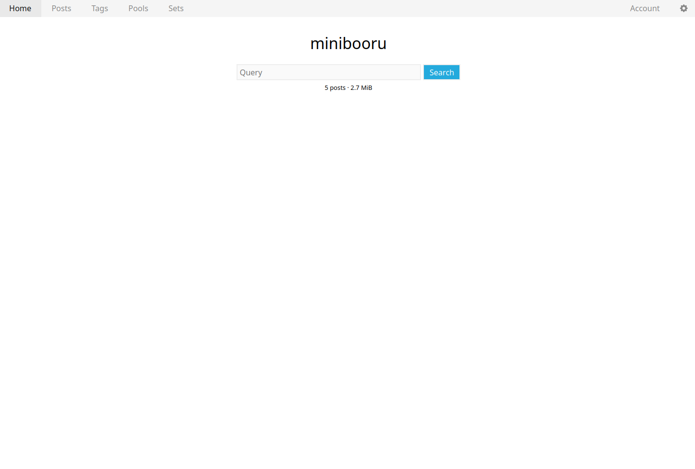
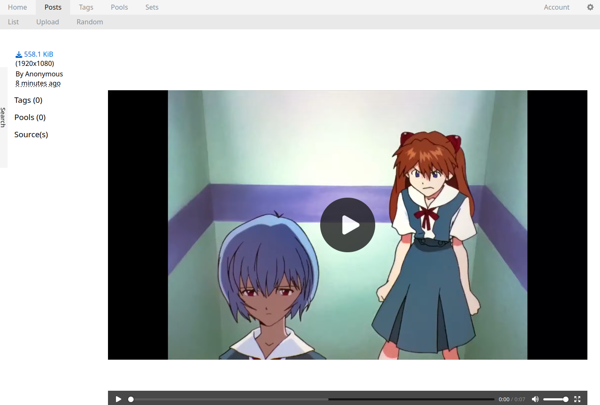

# [Pre-Alpha] minibooru

A Danbooru-style imageboard. It looks a lot like szurubooru.

## Screenshots

    
    
    

## Compatibility

Posts are flowed using the CSS masonry layout, which is not officially
supported in any mainstream browser. You can enable it in Firefox via the
`layout.css.grid-template-masonry-value.enabled` flag.

Might make this optional soon